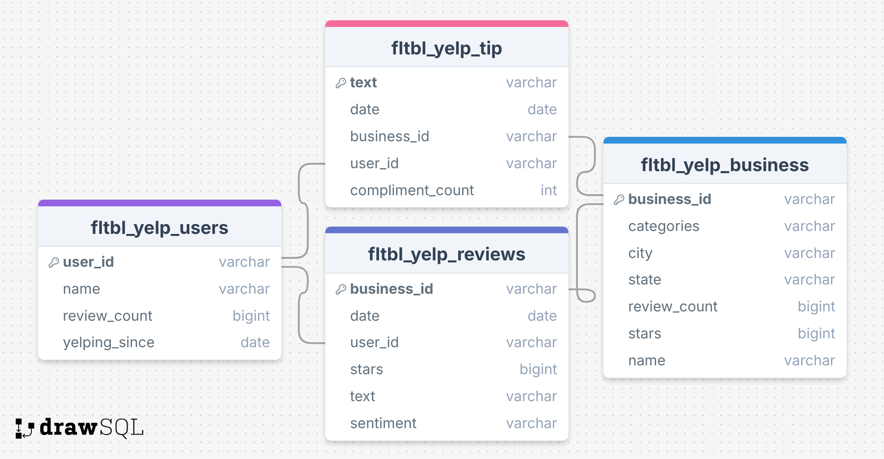

# Yelp Reviews Analysis

This project performs an end-to-end analysis of Yelp reviews data with the goal of extracting insights from textual and structured information about businesses and user experiences.

## 📊 Project Overview

The repository leverages the **Yelp Open Dataset** to explore patterns in customer reviews, ratings, and business metadata across various categories like restaurants, shopping, nightlife, and more.

Key components include:

- Data ingestion and cleaning
- Exploratory data analysis (EDA)
- Natural Language Processing (NLP) for review sentiment
- Snowflake sql analysis to answer business questions

## 🧊 Snowflake Integration

All SQL transformations, joins, and aggregations were performed using **Snowflake** as the central data warehouse. Additionally, sentiment analysis using **TextBlob** was executed directly within Snowflake using the **Snowpark for Python** and **UDFs**, enabling in-database analytics at scale.

## 📂 Repository Structure

```
yelp-reviews-analysis/
│
├── data/                     # Raw and processed data files (not included in repo)
├── snowflake_scripts/        # SQL scripts for flattening tables and analysis
├── requirements.txt          # Python dependencies
├── files_split.py            # Python code to split large files into multiple small files
├── snowflake_upload.py       # Python file to connect with snowflake and upload files
└── README.md                 # Project overview
```

## 📁 Dataset

The data used in this project is sourced from the [Yelp Open Dataset](https://business.yelp.com/data/resources/open-dataset/), which includes over 8 million reviews, 200K+ businesses, and various user/business metadata.

Please note: Due to size constraints, the dataset is **not included in this repository**. You can download it directly from the [official Yelp data page](https://business.yelp.com/data/resources/open-dataset/) and place the relevant JSON files in the `data/` folder.

## 🧱 Data Schema



## 🚀 How to Run

1. Clone this repository:

```bash
git clone https://github.com/subhammoda/yelp-reviews-analysis.git
cd yelp-reviews-analysis
```

2. Create a virtual environment and install dependencies:

```bash
pip install -r requirements.txt
```

3. Download the Yelp dataset from the [Yelp Open Dataset page](https://business.yelp.com/data/resources/open-dataset/) and extract it to the `data/` directory.

## 🧠 Techniques Used

- Python
- NLP: TextBlob
- Snowflake SQL for data processing and sentiment analysis via UDFs

## 📝 License

This project is open-source under the MIT License.

## 📬 Acknowledgements

- [Yelp Open Dataset](https://business.yelp.com/data/resources/open-dataset/) for making the data available to the public.

---

Feel free to contribute or raise an issue if you find something interesting!
